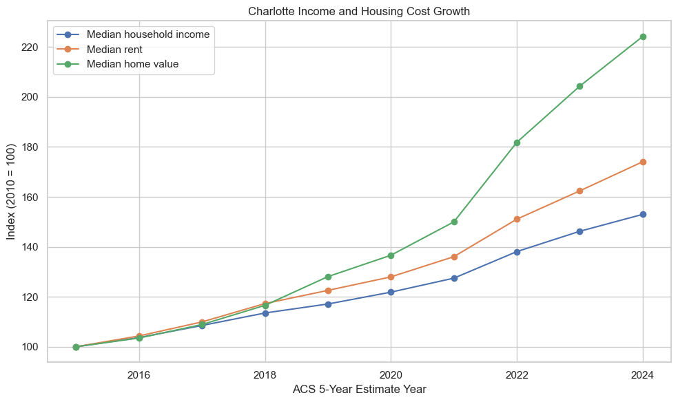
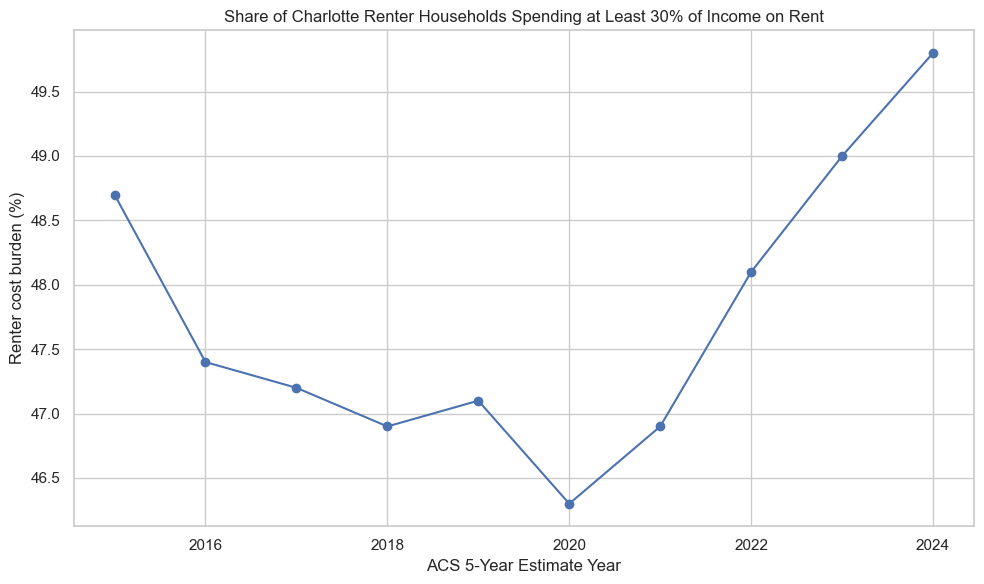

## Research Question
## Is Charlotte, North Carolina able to address adequate affordable housing needs in response to population and economic growth?

The analysis uses American Community Survey (ACS) 5-year estimates for the **City of Charlotte, North Carolina** from 2010–2024.

| Variable | ACS Variable | Definition |
|:---|:---:|:---|
| **Population** | `DP05_0001E` | Estimated total population |
| **Median Household Income** | `DP03_0062E` | Median household income in inflation-adjusted dollars |
| **Poverty Rate** | `DP03_0128PE` | Percentage of people below the poverty level |
| **Median Rent** | `DP04_0134E` | Median gross rent among occupied units paying rent |
| **Median Home Value** | `DP04_0089E` | Median value of owner-occupied housing units |
| **Housing Units** | `DP04_0001E` | Total number of housing units |
| **Renter Cost Burden** | `DP04_0141PE + DP04_0142PE` | Percentage of renter-occupied units paying 30% or more of household income toward gross rent |

## Data Cleaning and Preparation
- Rows with missing values are removed although when analysing the data I found that there was not any missing values.
- The two renter cost-burden categories are combined because both represent households spending at least 30% of income on gross rent.

## Exploratory Analysis
The next section answers three practical questions:

1. Did household income keep pace with rent and home-value growth?
2. Did renter cost burden improve or worsen over time?
3. Did population and housing supply grow at similar rates?

The graph shows that income, rent, and home values in Charlotte, NC all increased from 2015 to 2024. Home values had the biggest increase, while rent also increased significantly. Although median household income increased, it did not grow as quickly as rent and home values. This could suggest that housing became less affordable for Charlotte residents over time.

The graph shows that Charlotte's renter cost burden decreased between 2015 and 2020, but started increasing after 2020. By 2024, almost 50% of renter households were spending at least 30% of their income on rent. This shows that rent has become a growing financial burden for many Charlotte renters. The increase after 2020 may also suggest that housing affordability became a bigger issue in Charlotte in the years following the pandemic.

## Ethics and Limitations
**Potential bias in the data.** Survey nonresponse, measurement error, and differences in who is captured by survey estimates can affect results. ACS estimates should therefore be interpreted as estimates rather than exact counts.

**Total housing units are not the same as affordable housing units.** This project cannot determine how many units are subsidized, income-restricted, vacant, or affordable to a particular income group.

 **Affordability is more complicated than median values.** Median rent and median home value do not show whether low-income households can afford available units.

## Code and AI Transparency
**Data source:** U.S. Census Bureau, American Community Survey 5-Year Estimates, accessed through the Census Data API.

**AI disclosure:** Generative AI (ChatGPT, GPT-5.6 Luna) was used as a coding and writing assistant to help structure the beginner-level Python notebook, explain Census variables, and identify potential limitations.

## Conclusion
The key issue is not simply whether Charlotte has more housing units than it had in 2010. The more useful question is whether housing supply and household purchasing power are keeping pace with population growth. A city can add thousands of units while still becoming less affordable if rents and home values rise faster than incomes or if a large share of renters remain cost burdened. If population growth exceeds housing-unit growth, housing costs grow faster than household income, and renter cost burden remains high or increases, the evidence suggests that Charlotte's housing supply is under affordability pressure as the city grows. Charlotte is adding housing, but the available evidence suggests that growth in homes has not necessarily translated into adequate affordable housing for all households.

## Key Academic References

Brooks, M. M. (2022). The changing landscape of affordable housing in the rural and urban United States, 1990–2016. *Rural Sociology, 87*(2), 354–379. https://doi.org/10.1111/ruso.12427

Colburn, G., Hess, C., Allen, R., & Crowder, K. (2024). The dynamics of housing cost burden among renters in the United States. *Journal of Urban Affairs, 47*(7), 2403–2422. https://doi.org/10.1080/07352166.2023.2288587

Gold, S., et al. (2020). Does public housing reduce housing cost burden among low-income families with children? *Journal of Policy Analysis and Management, 39*(4), 1099–1120. https://doi.org/10.1002/pam.22218

Mehdipanah, R. (2023). Without affordable, accessible, and adequate housing, health has no foundation. *The Milbank Quarterly, 101*(S1), 309–330. https://doi.org/10.1111/1468-0009.12626

U.S. Census Bureau. (2024). *American Community Survey 5-year data*. https://www.census.gov/data/developers/data-sets/acs-5year/2024.html

