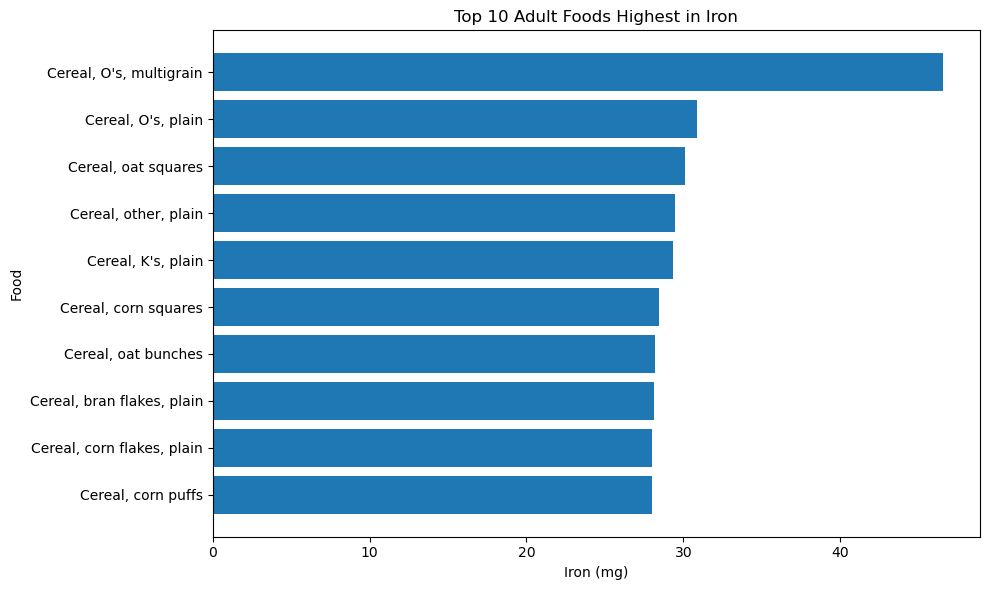
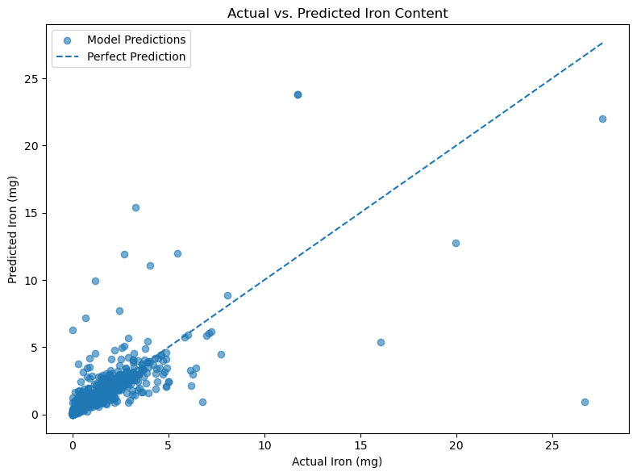
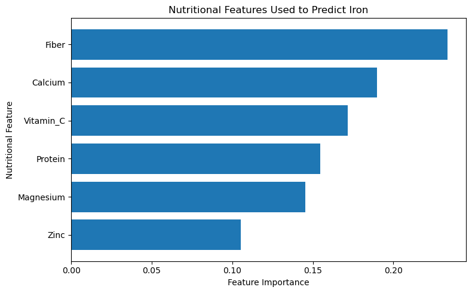

# Machine Learning - Project 2 

## Problem Definition

Iron is an important nutrient, particularly for individuals concerned about iron-deficiency anemia. This project explores whether nutritional characteristics of foods can be used to predict iron content and help identify foods that may contribute to maximizing dietary iron intake.

### Research Question

**How can dietary choices be optimized to maximize iron intake for individuals with iron-deficiency anemia?**

### Machine Learning Prediction Question

**Can available nutritional characteristics of foods be used to predict iron content and help identify foods that could contribute to maximizing dietary iron intake?**

This project uses **regression** because the target variable, iron content, is numerical.

The target variable is **Iron (mg)**.

---

## Background and Context

Iron is an essential nutrient that plays an important role in functions such as oxygen transport, DNA synthesis, and energy production. Iron-deficiency anemia can occur for several reasons, including decreased dietary iron intake and decreased iron absorption. Because diet can contribute to iron intake, identifying foods with higher iron content may help individuals make more informed dietary choices (Kumar et al., 2022).

This topic is also personally important to me because I have anemia. My personal experience with anemia motivated me to explore nutrition and better understand which characteristics of foods may be associated with higher iron content. This project gave me the opportunity to connect a health topic that affects me personally with data science and machine learning.

Iron deficiency can also be influenced by factors beyond diet. Rabinowitz (2024) discusses differences in iron deficiency among Black populations and highlights research suggesting that genetic and environmental factors may contribute to differences in iron status. This demonstrates why dietary iron alone cannot fully explain an individual's risk of iron deficiency.

The relationship between iron and other nutritional characteristics is also important when studying foods. Ding et al. (2024) examined the interaction between iron and whey protein isolate and found that the ratio of iron to protein affected the iron-binding capacity of whey protein isolate. Their research demonstrates that iron can interact with other nutritional components rather than functioning independently within food products.

These findings provide context for this project's use of nutritional characteristics such as protein, fiber, vitamin C, calcium, magnesium, and zinc to predict the iron content of foods. The purpose of the machine learning model is to identify nutritional patterns associated with food iron content and explore foods that may contribute to maximizing dietary iron intake. However, the model predicts the iron content of foods rather than iron absorption or changes in an individual's iron-deficiency anemia.

---

## Data Description

The dataset used for this project is the **USDA Food and Nutrient Database for Dietary Studies (FNDDS) 2021–2023**.

Each row represents a food item and contains information about its nutritional composition.

The target variable used for machine learning is:

- **Iron**

The predictor features selected for the model are:

- Protein
- Fiber
- Vitamin C
- Calcium
- Magnesium
- Zinc

Before modeling, the dataset was inspected for missing values and summary statistics. Infant, baby, and toddler foods were excluded because this project focuses on dietary choices relevant to adults.

---

## Data Preparation and Exploration

The dataset was cleaned and reduced to the variables needed for the project. During the data preparation process, the Iron and Zinc column names required additional attention when selecting and renaming the nutritional variables.

Rows containing missing values in the selected modeling variables were removed before training the models.

The distribution of iron was also explored, along with correlations between iron and the selected nutritional characteristics.

### Adult Foods Highest in Iron

The following graph shows the ten adult foods with the highest iron content in the dataset.

The results show that several cereals were among the foods with the highest iron content in the dataset. The highest value was found for multigrain O's cereal, followed by several other cereal varieties.

---

## Machine Learning Preparation

The following nutritional characteristics were used as predictor variables:

- Protein
- Fiber
- Vitamin C
- Calcium
- Magnesium
- Zinc

Iron was used as the target variable.

The data was divided using an **80/20 train-test split**. Eighty percent of the observations were used to train the models, while 20% were reserved for testing. A random state of 42 was used to make the split reproducible.

---

## Baseline and Model Development

Three approaches were evaluated:

1. **Baseline Dummy Regressor**
2. **Linear Regression**
3. **Random Forest Regression**

The baseline model predicted the mean iron value and provided a simple benchmark for comparison.

Linear Regression was used as one machine learning model to examine whether the nutritional features could predict iron using linear relationships.

Random Forest Regression was also used because it can identify more complex relationships between the nutritional features and iron content.

---

## Model Evaluation

The models were evaluated using three regression metrics:

- **MAE (Mean Absolute Error):** measures the average size of the prediction errors.
- **RMSE (Root Mean Squared Error):** measures prediction error while giving greater weight to larger errors.
- **R²:** measures how much of the variation in iron content is explained by the model.

| Model | MAE | RMSE | R² |
|---|---:|---:|---:|
| Baseline | 1.0628 | 1.8620 | -0.0061 |
| Linear Regression | 0.7901 | 1.7110 | 0.1504 |
| **Random Forest** | **0.4495** | **1.4030** | **0.4287** |

The **Random Forest model performed the strongest** of the three approaches. It had the lowest MAE and RMSE and the highest R².

The Random Forest MAE of approximately **0.45 mg** means that its predictions were about 0.45 mg away from the actual iron values on average.

Its R² of approximately **0.43** indicates that the model explained about 43% of the variation in iron content within the test data.

Although Random Forest performed substantially better than the baseline and Linear Regression models, a considerable amount of variation in iron content remains unexplained.

---

## Actual vs. Predicted Iron Content

The following graph compares the actual iron content of foods in the test data with the values predicted by the Random Forest model.

Points closer to the dashed perfect-prediction line represent more accurate predictions.

Many foods with lower iron values were relatively close to the line. However, several observations farther from the line show that the model sometimes substantially overpredicted or underpredicted iron content. Some of the largest errors occurred among foods with unusually high iron values.

---

## Model Interpretation

Feature importance was used to examine which nutritional characteristics contributed most to the Random Forest model's predictions.

**Fiber had the highest feature importance**, followed by calcium and vitamin C. Protein and magnesium also contributed to the model, while zinc had the lowest feature importance among the selected variables.

These results show which nutritional characteristics were most useful to the Random Forest model when predicting iron content.

However, feature importance does **not** demonstrate causation. For example, the results do not mean that fiber causes a food to contain more iron or that consuming more fiber will improve iron-deficiency anemia.

---

## Conclusion

## Conclusion

This project investigated whether nutritional characteristics of foods could be used to predict iron content and help identify foods that may contribute to maximizing dietary iron intake.

Among the models evaluated, Random Forest Regression produced the strongest predictive performance, with an MAE of approximately 0.45 mg, an RMSE of 1.40 mg, and an R² of 0.43. These results show that nutritional characteristics can provide useful information for predicting food iron content, although they do not completely explain the differences in iron levels between foods.

The feature importance analysis showed that fiber contributed the most to the Random Forest model's predictions, followed by calcium and vitamin C. The analysis of high-iron foods also produced an interesting pattern: all ten of the highest-iron adult foods identified in the dataset were cereals. While this does not mean that cereal is necessarily the best dietary choice for someone with anemia, it highlights how certain foods, including potentially fortified foods, can contain substantially higher amounts of iron.

Overall, this project allowed me to connect my personal experience with anemia to data science and explore how machine learning can be used to better understand the nutritional characteristics of foods. The model can help identify patterns and support the exploration of iron-rich dietary choices, but it cannot determine whether a food will treat anemia or improve an individual's iron status.

And with cereal taking all ten spots among the highest-iron foods in this analysis, perhaps the saying that **"breakfast is the most important meal of the day"** takes on a new meaning in the context of this project.

---

## Limitations, Ethics, and Reflection

This project has several limitations.

Some foods may contain added or fortified iron, which could produce unusually high iron values that are not fully explained by the nutritional features included in the model.

Rows containing missing values were removed before modeling. Removing incomplete observations may affect which types of foods are represented in the final modeling dataset.

The Actual vs. Predicted graph also shows that the model had difficulty predicting some foods with unusually high iron values. Therefore, predictions should not be assumed to be equally accurate for every type of food.

Feature importance represents predictive relationships rather than causal relationships. A nutrient having high feature importance does not mean that consuming that nutrient will increase a person's iron level.

Most importantly, this model predicts **food iron content, not human health outcomes**. Iron-deficiency anemia involves factors beyond the nutritional composition of an individual food. Therefore, this model should not be used as a medical diagnostic or treatment tool.

Future work could examine additional nutritional characteristics, investigate the effect of fortified foods, or compare additional machine learning models.

---

## Project Code

The complete Jupyter Notebook containing the data preparation, exploration, machine learning models, evaluation, and interpretation is available below:

[View the Complete Jupyter Notebook](DTSCPJ2.ipynb)

---

## References

Kumar, A., Sharma, E., Marley, A., Samaan, M. A., & Brookes, M. J. (2022). Iron deficiency anaemia: Pathophysiology, assessment, practical management. *BMJ Open Gastroenterology, 9*(1), e000759.

Rabinowitz, J. (2024, June 12). *Why is iron deficiency more common in Black people?* Smart Eats.

Ding, X., Liu, Y., Zheng, L., Chang, Q., Chen, X., & Xi, C. (2024). Effect of different iron ratios on interaction and thermodynamic stability of bound whey protein isolate. *Food Research International, 182*, 114198. https://doi.org/10.1016/j.foodres.2024.114198

---

## AI Usage Disclosure

ChatGPT (OpenAI, GPT-5.6) was used during this project to assist with understanding Python code, debugging errors, organizing the machine-learning workflow, interpreting model evaluation metrics, and improving written explanations. AI-generated suggestions were reviewed and adapted for this project.
